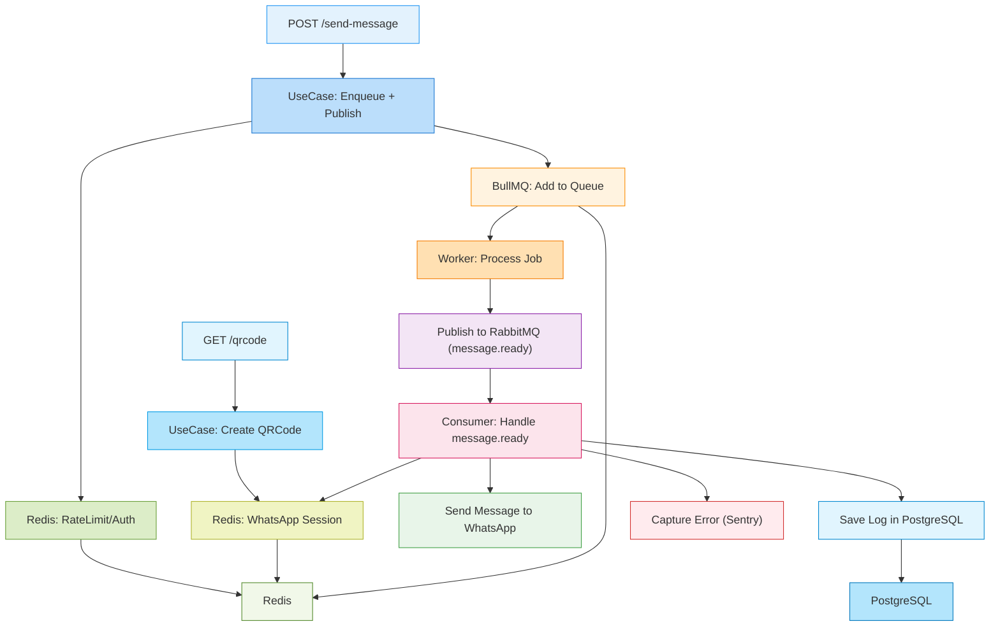

# 📦 Ezap Bulk Sender


<p align="center">
  
</p>

Scalable system for sending automated WhatsApp messages using a decoupled architecture, asynchronous queues, messaging, and orchestration with **Nx** in a monorepo.

---

## ✨ Technologies

- **Monorepo with Nx**
- Node.js + Express
- BullMQ + Redis
- RabbitMQ
- Drizzle
- PostgreSQL + Drizzle ORM
- WhatsApp (via Baileys)
- Sentry + Pino (Logs and observability)
- Artillery (Load testing)
- Vitest (Unit and integration tests)
- Docker Compose

---

## 🧱 Nx Structure

The project is structured as a monorepo with Nx, containing:

| Project                  | Description                              |
|--------------------------|------------------------------------------|
| `ezap-bulk-sender-api`   | Backend for sending messages via queues |
| `ezap-bulk-sender-front` | Frontend with CSV upload and sending visualization |

---

### 🧱 Project Architecture



---

## ⚙️ How to run locally

### 1. Clone the project

```
git clone https://github.com/EliseuSantos/ezap-bulk-sender.git
cd ezap-bulk-sender
```

### 2. Configure the environment

```
cp apps/backend/.env.example .env
```

```
cp apps/frontend/.env.example .env
```

### 3. Start the infrastructure with Docker Compose

```
docker-compose up --build
```

The application will be available at:

| Service          | URL                                      |
|------------------|------------------------------------------|
| API (Express)    | `http://localhost:3000`                  |
| Frontend (Next)  | `http://localhost:3001`                  |
| RabbitMQ UI      | `http://localhost:15672` (`guest/guest`) |
| Redis Commander  | `http://localhost:8081`                  |
| Drizzle Studio   | `https://local.drizzle.studio`           |
| PostgreSQL       | `localhost:5432`                         |

---

## 🚀 Useful Scripts (via Nx)

| Command                          | Description                                     |
|----------------------------------|-------------------------------------------------|
| `npx nx run ezap-bulk-sender-api:dev`                       | Starts the backend and frontend in dev mode     |
| `npx nx run ezap-bulk-sender-api:studio`                    | Opens Drizzle Studio                            |
| `npx nx run-many --target=serve --projects=ezap-bulk-sender-api,ezap-bulk-sender-front --parallel`| Starts multiple projects in parallel            |

---

## 📩 Message Sending Flow

1. `POST /send-message` request
2. Message is queued with BullMQ
3. Event is published to RabbitMQ
4. Worker consumes the event and sends it via WhatsApp
5. In case of an error:
   - Retry with exponential backoff
   - Logs in Sentry and via Pino
   - Sending log is persisted in PostgreSQL

---

## 🧪 Tests

Organized into:

- `__tests__/unit` – Business rules and services
- `__tests__/integration` – Flow and infrastructure integration tests
- `__tests__/load` – Load tests

---

## 🛡️ Security

- Helmet, CORS, and XSS protection
- Rate limiting by IP
- Validation with Zod + zod-express-middleware

---

## ✅ License

Creative Commons Attribution-NonCommercial 4.0 International Public License
